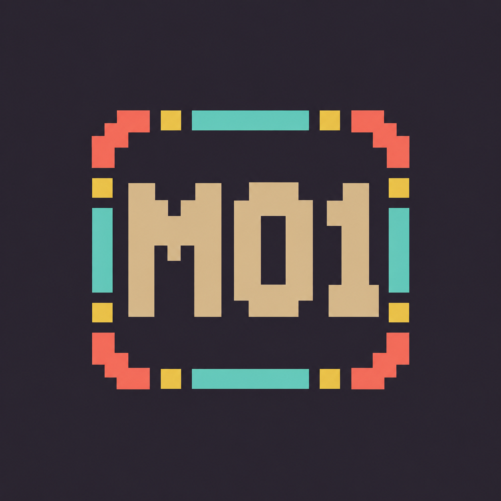
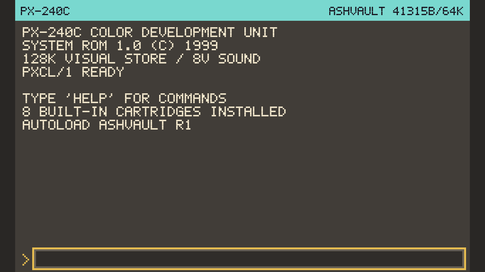
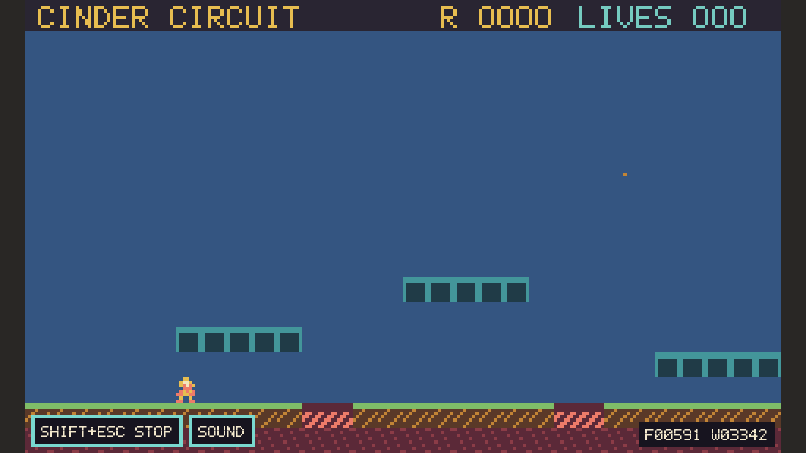
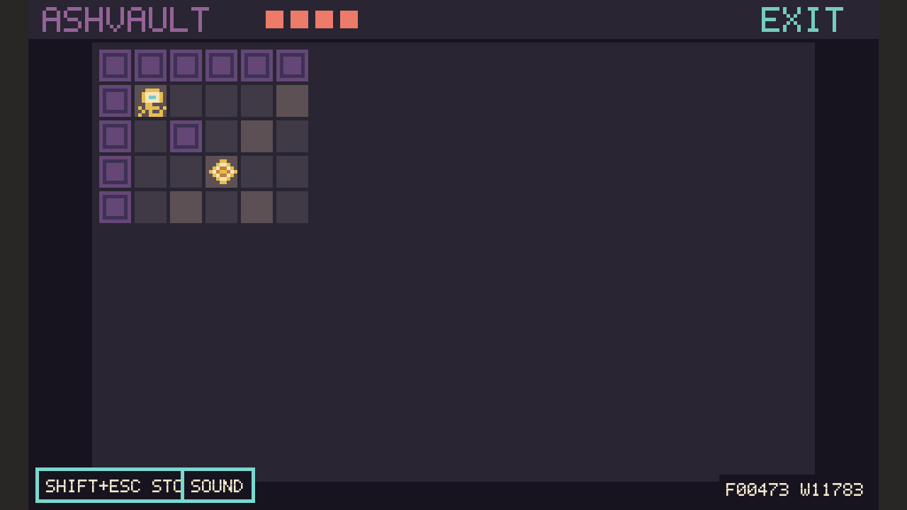
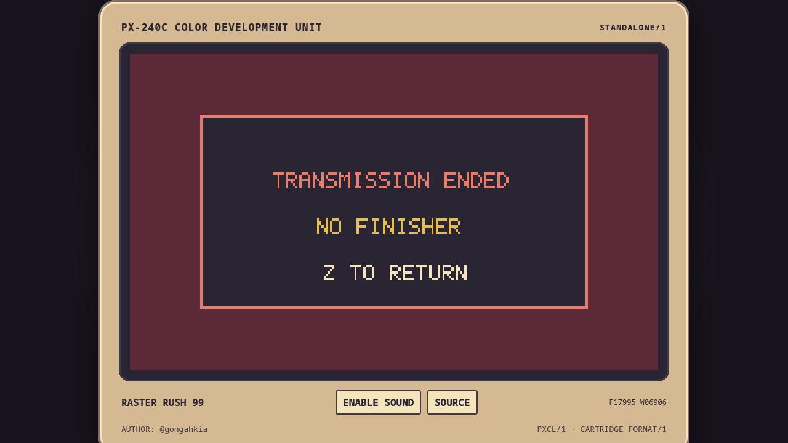

<p align="center">
  <a href="#mod-01-color-development-unit"></a>
</p>

<p align="center">
  <a href="https://github.com/gongahkia/MOD-01/actions/workflows/ci.yml"></a>
</p>

# MOD-01 Color Development Unit

<p align="center"><strong>A local-first colour fantasy console from an alternate 1999.</strong></p>

MOD-01 is a complete local-first fantasy console presented as a technically unusual, commercially
unsuccessful colour handheld from 1999. Its V1 release candidate includes the statically typed MODL/1 language,
Rust/Wasm compiler, deterministic worker runtime, 240x144 integrated Studio, source debugger and
rewind, native CLI/LSP, reproducible cartridges, shared headless/offline standalone execution, three
original pack-in games, three size-class showcases, a service cartridge, and a source-visible tutorial.

Made by @gongahkia. Copyright 2026 @gongahkia. All rights reserved. This repository is private and
proprietary; cartridge authors retain ownership of their source and assets.

## Contents

- [V1 release-candidate status](#v1-release-candidate-status)
- [Quick start](#quick-start)
- [Boundaries](#boundaries)



## V1 release-candidate status

The cohesive V1 workflow is implemented: create/import a cartridge, edit code and source-visible
assets, compile, run, debug, rewind, save/recover, pack, inspect, and export without an account or
backend. The production app is a relative-path static PWA and works offline after its first
successful load. The V1 contract is recorded in [product principles](docs/PRODUCT.md),
[limits](docs/LIMITS.md), and [release evidence](docs/V1_RELEASE_EVIDENCE.md); implementation detail
and history remain in [`docs/`](docs/PROGRESS.md).

The monitor preinstalls eight source-visible first-party cartridges. The three preserved original
games are ordinary public-facility MODL projects:

| Game                                        | Focus                                                                               |
| ------------------------------------------- | ----------------------------------------------------------------------------------- |
| [Cinder Circuit](cartridges/cinder-circuit) | Responsive tile platforming, animation, tasks, camera, and SFX                      |
| [Ashvault](cartridges/ashvault)             | Procedural fog-of-war roguelike, records/lists, enemies, and isolated save progress |
| [Raster Rush 99](cartridges/raster-rush)    | Scanline pseudo-3D racing, synth music, and simultaneous 2-4 player split screen    |





The [full bundled-cartridge catalog](cartridges/README.md) also covers the Hardware Revision 1
service cart, three size-class showcases, and the FIRST SIGNAL tutorial.

## Quick start

Requirements are Node.js 22.22 or newer and Rust 1.98. `corepack enable` supplies the pinned pnpm
10.32.1; the repository's `rust-toolchain.toml` selects Rust, Clippy, rustfmt, and
`wasm32-unknown-unknown`. The one setup command installs locked dependencies, installs the pinned
`wasm-bindgen-cli` 0.2.128 when absent, installs the pinned Playwright Firefox and Chromium test
browsers, and builds the complete project:

```sh
corepack enable
make setup
pnpm dev
```

Open the printed local URL. The monitor shell starts with all built-in cartridges installed. Use `dir`,
`load raster-rush`, `run`, or `run ashvault` to launch a cartridge directly; Shift+Escape stops a game. `help` lists integrated commands. Keyboard
port one uses arrows plus Z/X/A/S, while standard gamepads populate all four ports.

Run every repository gate with:

```sh
make check
```

This includes the production build and the pinned Firefox and Chromium end-to-end workflows.

For the native external-editor workflow:

```sh
cargo run -p mod01-cli -- new my-game --title "MY GAME"
cargo run -p mod01-cli -- check my-game
cargo run -p mod01-cli -- test my-game
cargo run -p mod01-cli -- run my-game
cargo run -p mod01-cli -- run my-game --headless --frames 120 --input path/to/replay.json
cargo run -p mod01-cli -- export html my-game
```

See the [interactive/from-scratch tutorial](docs/TUTORIAL.md), [runnable examples](examples/README.md),
[starter cartridges](templates/README.md), [tool guide](docs/TOOLS.md),
[MODL language contract](docs/LANGUAGE.md), and [cartridge format](docs/CARTRIDGE_FORMAT.md).

## Boundaries

This V1 candidate has no cloud account, synchronization, hosted backend, gallery, network/multiplayer API,
desktop GUI, third-party cartridge compatibility, raw JavaScript escape, true-colour path, samples,
physics engine, ECS, scene graph, or real 3D renderer. Worker containment is a practical browser
boundary, not process-level isolation; [SECURITY.md](docs/SECURITY.md) states the exact limits.

To refresh the Studio boot capture, run the production preview in one terminal:

```sh
pnpm build
pnpm --dir apps/studio exec vite preview --host 127.0.0.1 --port 4173 --strictPort
```

Then, in another terminal, run `node scripts/capture-v1-visuals.mjs` and copy its 1280x720 Firefox
shell capture from `output/playwright/v1-firefox-shell.png` to `docs/images/studio-shell.png`. The
checked images use exact integer scale Playwright captures; no mockups are used.
